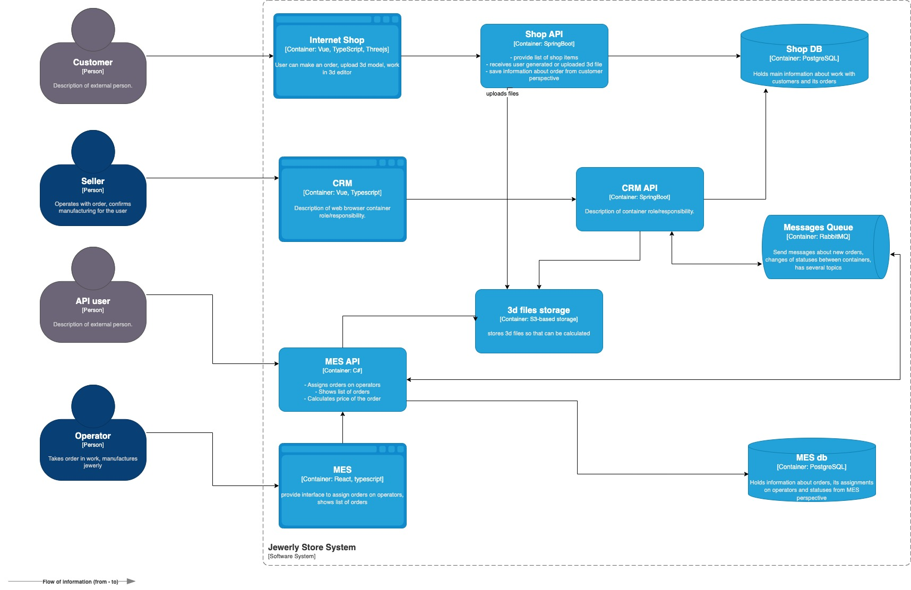

## Что нужно сделать

 1. Создайте в директории Exc1 текстовый файл и назовите его «Планирование: анализ, идентификация проблем и поиск решений». Работайте над заданием в этом файле.

 2. Проанализируйте схему и описание системы. Идентифицируйте существующие и потенциальные проблемные места. Напишите их список.

 3. Разработайте инициативы, которые необходимы для устранения нежелательных ситуаций. Запишите их в список.

 4. Расставьте инициативы в порядке приоритета. Опишите ход своих рассуждений и ответьте на вопросы:

    4.1. Какой вы видите целевую архитектуру через полгода?

    4.2 Если бы у вас была возможность выполнить только три пункта из списка инициатив в ближайшие полгода, что бы вы выбрали и почему? Не обязательно добавлять в список только эпики. Вы можете включить в план как крупные изменения, так и локальные задачи.

___

# 2. Проанализируйте схему и описание системы. Идентифицируйте существующие и потенциальные проблемные места. Напишите их список.

## Инфраструктураные проблемы

EC2 под каждый сервис предполагает расходы на управление (внесение изменений, бекапы / восстановление, мониторинг, масштабирование).
Потенциально затраты можно сократить, при условии что сервисы запускаются как контейнеры в централизованной среде например kubernetes.

File Storage целесообразно использовать как SaaS, оптимизируя расходы на управление , масштабирование, бекапы и расходы на CPU существующей выделенной машины EC2.

Message queue целесообразно использовать как SaaS, оптимизируя расходы на управление , масштабирование, бекапы и расходы на CPU существующей выделенной машины EC2.

Сервисы API, в случае отсутствия неспецифичного для аналогичного API GW функционала (SaaS) сервиса, целесообразно использовать как SaaS, оптимизируя расходы на управление , масштабирование, бекапы и расходы на CPU существующей выделенной машины EC2.

EC2 помимо перечисленного выше предполагают расходы на управление операционной системой как в каждом выделенном инстансе, так и управление политикой всех инстансов в целом.

Учитывая что в отдельно взятом окружени кол-во EC2 == 8, то предполагаем, что в трех окружениях dev, release и prod суммарное кол-во машин EC2 будет 24. Целесообразно рассмотреть переход с 24 отдельно взятых объекта IaaS (EC2) на 3 объекта SaaS (k8s).

## Проблемы нагрузки

Для приложения MES целесообразно использование serverless функций (function as a service).

С высокой степенью вероятности переход от виртуальных машин на микросервисы приведет к снижению:
 - затрат на эксплуатацию и поддержку инфраструктуры
 - финансовых затрат на выделенные (зарезервированные) вычислительные ресурсы EC2
 - метрики time to market (TTM) в разрезе сопровождения жизненного цикла разработки программного обеспечения (SDLC)

