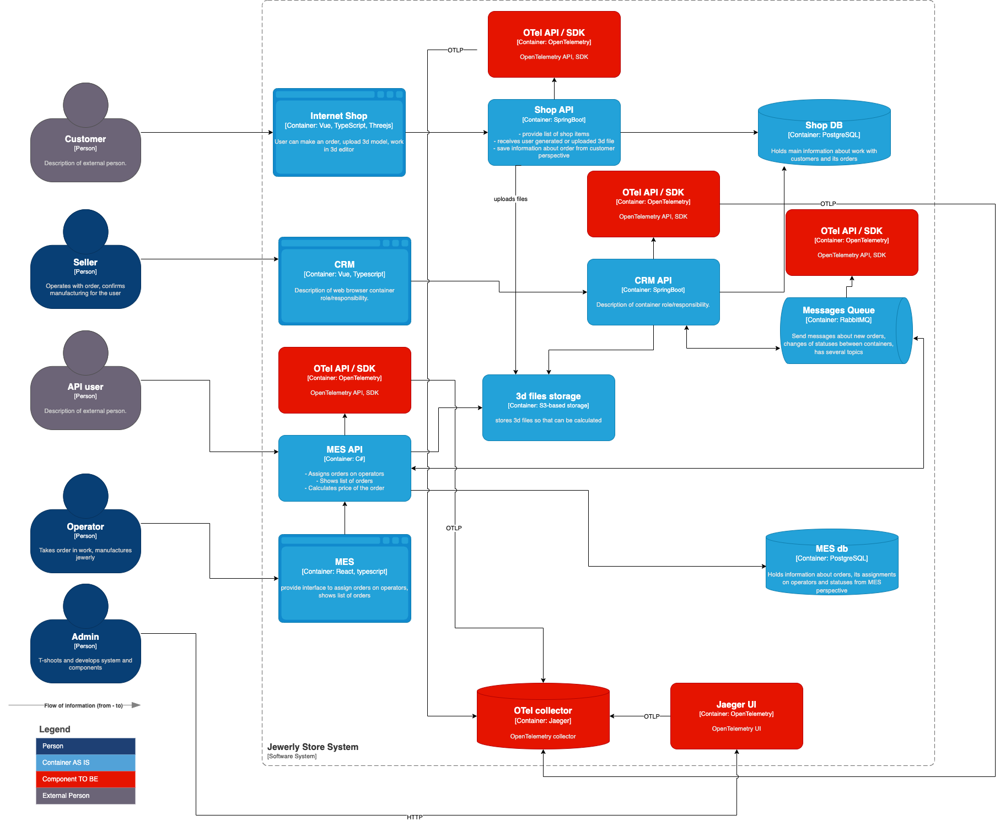

# 1. Создайте в директории Exc3 текстовый файл «Архитектурное решение по трейсингу». В нём вы будете работать над заданием.

++

# 2. Проанализируйте систему компании и C4-диаграмму в контексте планирования трейсинга. Напишите и выделите на схеме системы, которые следует покрыть трейсингом. Для этого идентифицируйте места, где заказ может «сломаться» или зависнуть.

Составьте список данных, которые должны попадать в трейсинг

Предположим что заказ может зависнуть на любом из этапов, в соответствии с жизненным циклом:

 - INITIATED [онлайн-магазин] — пользователь завёл новый заказ или положил товары в пустую корзину.
 - FILE_UPLOADED [онлайн-магазин] — пользователь загрузил файл с 3D-моделью или создал его с помощью конструктора.
 - SUBMITTED [онлайн-магазин] — пользователь нажал на кнопку «Сделать заказ».
 - PRICE_CALCULATED [MES] — система посчитала стоимость заказа.
 - MANUFACTURING_APPROVED [CRM] — заказ подтверждён, его можно отдавать в производство.
 - MANUFACTURING_STARTED [MES] — оператор взял заказ в работу.
 - MANUFACTURING_COMPLETED [MES] — оператор выполнил заказ.
 - PACKAGING [MES] — оператор начал упаковывать заказ.
 - SHIPPED [MES] — заказ отправлен покупателю.
 - CLOSED [CRM] — заказ завершён. Он закрывается после получения сообщения от транспортной компании или вручную.

Следовательно системы, которые следует покрыть трейсингом в первую очередь это:
 
 - [онлайн-магазин] - Shop API
 - [MES] - MES API
 - [CRM] - CRM API
 - Message Queue (используется как CRM, так и MES)

Список данных, которые должны попадать в трейсинг:

 - service id
 - trace_id
 - span_id
 - source (originator) 
 - destination (endpoint)
 - http request (url / method)
 - db request (url / method)
 - timestamp

# 3. Добавьте в файл раздел «Мотивация». Напишите здесь, почему в систему нужно добавить трейсинг и что это даст компании. Опишите возможные три-пять технические и бизнес-метрики решения, на которые повлияет внедрение трейсинга.

# Мотивация 

Трейсинг поможет выявить узкие места на этапах жизненного цикла заказов, а конкретно проследить путь системных вызовов и выявить причину просроченных заказов.

Бизнес метрики:

  - время нахождения заказа на каждом этапе
  - кол-во просроченных заказов
  - этапы, на которых заказы тормозят
  - потерянные заказы

# 4. Добавьте раздел «Предлагаемое решение». Опишите, как и с помощью каких технологий будет реализован трейсинг, какие компоненты нужно внедрить или доработать. Отразите компоненты и новые связи на схеме. Скачайте диаграмму контейнеров Александрита» в модели C4. Доработайте диаграмму, исходя из вашего решения: отразите на ней новые компоненты и связи. Новые элементы выделяйте красным цветом — так ревьюеру будет проще проверить вашу работу. Когда схема будет готова, добавьте ссылку на неё в раздел «Предлагаемое решение».

## Предлагаемое решение

Как вариант добавляем компоненты OpenTelemetry (OTel):

 - OTel API, SDK - для отправки трейсов из приложения
 - OTel Collector (Jaeger)- для сбора трейсов
 - Jaeger UI - для визуализации информации на основе трейсов

# 5. Добавьте раздел «Компромиссы». Опишите, в каких случаях трейсинг не принесёт пользы или пока невозможен, или его реализация обойдётся слишком дорого.

Например, сложно заставить проприетарную систему отдавать метрики в нужном формате, может потребоваться дорогостоящая доработка.

## Компромиссы

Внедрение компонентов OTel API, SDK предполагает изменения кода приложения. В случае если изменения недопустимы или необоснованно дороги, возможно использование другого сценария для снятия трейсов:
 
 - Использование прокси сервиса для каждого микросервиса. В качестве такого сервиса может выступать Istio Service Mesh.
 - Прокси добавляется как sidecar container к каждому микросервису системы
 - Все вызовы в/из серсвисов приложения проходят через прокси
 - Istio собирает информацию о всех вызовах проходящих через прокси и визуализирует в Web UI

Однако в нашем случае, если мы используем виртуальных машины, а не контейнеризированную среду для управления контейнерами, внедрение прокси сервисов может быть трудозатратным.

# 6. Проработайте аспекты безопасности. Опишите, какие меры для предотвращения несанкционированного доступа будут предусмотрены для системы трейсинга внутри компании и снаружи если это требуется.

Например: «Внедрение аутентификации — зайти в систему смогут только сотрудники компании с актуальной учетной записью и ролью “Поддержка”».

Безусловно отладочную информацию из трейсов предоставлять кому-либо "наружу" не стоит:

 - Система управления трейсами должна быть изолированна во внутреннем контуре.
 - Доступ внутри контура должен быть предоставлен выделенной группе сотрудников, прошедших авторизацию.
 - Информация из трейсов должна быть обфусцирована, поскольку в ней могут содержаться чувствительные данные клиентов.

# 7. Дополнительное задание. Спроектируйте и опишите в разделе «Предлагаемое решение», как будет реализованы автоматический мониторинг процесса прохождения заказа, полученные из данных трейсинга, и алертинг. Обновите последний вариант диаграммы, который вы подготовили для этого раздела, — отразите на нём необходимые связи. Новые элементы выделяйте зелёным цветом. Добавьте отдельную ссылку на новый вариант диаграммы.

--