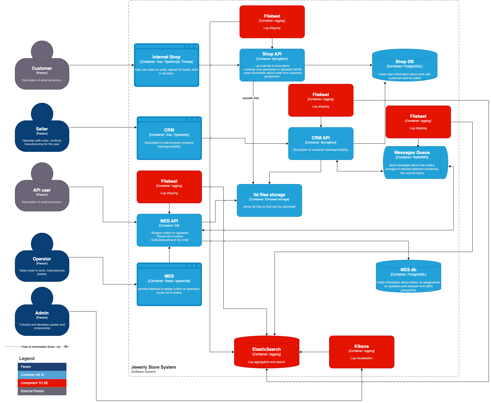

# 1. Создайте в директории Exc4 файл «Архитектурное решение по логированию». Здесь вы будете работать над заданием.

# 2. Проанализируйте систему компании и C4-диаграмму в контексте планирования логирования. Опишите, какие логи нужно собирать и отметьте на схеме, из каких систем требуется сбор логов. Составьте список необходимых логов с уровнем INFO.

Например, изменение статуса заказа. Логируем время, идентификатор покупателя, номер заказа.
Напишите, будете ли вы использовать другие уровни логирования и при каких обстоятельствах

В первую очередь нас интересуют логи связанные с жизненным циклом заказа, пусть это будут сообщения уровня INFO: 

 - INITIATED [онлайн-магазин] — пользователь завёл новый заказ или положил товары в пустую корзину.
 - FILE_UPLOADED [онлайн-магазин] — пользователь загрузил файл с 3D-моделью или создал его с помощью конструктора.
 - SUBMITTED [онлайн-магазин] — пользователь нажал на кнопку «Сделать заказ».
 - PRICE_CALCULATED [MES] — система посчитала стоимость заказа.
 - MANUFACTURING_APPROVED [CRM] — заказ подтверждён, его можно отдавать в производство.
 - MANUFACTURING_STARTED [MES] — оператор взял заказ в работу.
 - MANUFACTURING_COMPLETED [MES] — оператор выполнил заказ.
 - PACKAGING [MES] — оператор начал упаковывать заказ.
 - SHIPPED [MES] — заказ отправлен покупателю.
 - CLOSED [CRM] — заказ завершён. Он закрывается после получения сообщения от транспортной компании или вручную.

Для всех логов верным будет формат типа:

 - Unique Message ID - уникальный идентификатор сообщения
 - Unix Timestamp - временная метка на момент создания сообщения в unix формате
 - Service Initiator ID - сервис создавший запись
 - Severity - уровень критичности
 - User ID - уникальный идентификатор пользователя, создавшего событие
 - Action - действие пользователя (например CRUD формат)
 - Status - результат действия (SUCCESS / FAIL)
 - Data - дополнительные данные в соответствии с уровнем критичности сообщения
 - (опционально) HASH-SUM - для обеспечения неизменимости тела сообщения

Например:

 - 3028a2b9-54d8-41c0-bc6b-5ea6d028dadf, 1739114110, MES API, INFO, 39de626d-4996-4214-b106-1ffe374115c7, CREATE ORDER, SUCCESS, Additional Info

Помимо логов приложения потребуются логи инфраструктуры:

 - Логи операционной системы, как минимум ERROR, FATAL
 - Логи баз данных, как минимум ERROR, FATAL
 - Логи сервиса очередей, как минимум ERROR, FATAL

# 3. Добавьте в файл раздел «Мотивация». Напишите здесь, почему в систему нужно добавить логирование и что это даст компании. Опишите три-пять технические и бизнес-метрики решения, на которые может повлиять внедрение логирования.

Команда не сможет реализовать единовременно логирование и трейсинг всех выделенных для этого систем. Поэтому опишите, для каких систем нужно настраивать логирование и трейсинг в первую очередь и почему.

## Мотивация

Система логирования:

 - Качество приложения/системы/бизнес процессов. Система покажет общее количество ошибок, и кол-во ошибок в моменте.
 - Информация для локализации проблемы. По каждой ошибке система даст дополнительную текстовую информацию, которая поможет локализовать причину возникновения
 - Безопасность. В минимальной степени отобразит события связанные с безопасностью (например попытки перебора паролей)
 - (для обеспечения целостного мониторинга безопасности и предотвращения инцидентов принято внедрять несколько другие системы  (SIEM, DLP, Antivirus, Firewall и т.п.))

Уровень логирования INFO должен быть включен безусловно для всех компонент системы. И как правило не представляет проблем в реализации.
Проблемы как правило связаны с дисковым пространством. Конфигурации ротации логов может решить проблему, однако полностью отказываться от логирования не стоит.
В случае если сообщений INFO неоправданно много, и ротация происходит в течение нескольких часов, возможны варианты перехода на уровень логирования WARNING или ERROR.

Если речь идет о выборе сервисов которые должны быть включены в систему ЦЕНТРАЛИЗОВАННОГО мониторинга в разрезе проблем с производительностью, то предлагаю рассмотреть сервисы:

 - Shop API
 - CRM API
 - MES API
 - Message Queue

На радаре отобразить сообщения типа ERROR для оценки их количества.

# 4. Добавьте раздел «Предлагаемое решение».

Опишите, как и с помощью каких технологий будет реализовано логирование, какие компоненты нужно внедрить или доработать. Отразите компоненты и новые связи на схеме.
Проработайте политику безопасности в отношении логов — как будет происходить работа с чувствительными данными, кто будет иметь доступ к логам.
Проработайте политику хранения в отношении логов — будет ли это отдельный индекс под систему, сколько они будут храниться и какого размера будут.

 - Сервисы должны производить записи в журналах, записи должны маскировать чувствительные данные
 - На виртуальные машины устанавливается opensource компоненты filebeat
 - В конфигурации filebeat настраивается лог-коллектор куда записи будут отправлены, при необходимости в конфигурации выполняется маскирование данных
 - В конфигурации filebeat настраивается индекс под приложение / сервис
 - В качестве SaaS решения может быть выбран лог-коллектор и UI, или на отдельную виртуальную машину (или несколько ноды если кластер) устанавливается компонент ElasticSearch, которые будет выполнять функции агрегации и поиска сообщений
 - На отдельную виртуальную машину устанавливается компонент для визуализации поиска и статистики по сообщениям логов.

## Политика ротации
Политика ротации будет зависеть главным образом от поставленных целей и бюджета в рамках целей.
Для сложных систем рассчитывается прогноз по месту на дисках в соответствии с количеством и составом отдельного сообщения.
В нашем случае будем отталкиваться от выделенного места под хранение записей на машине или SaaS сервисе ElasticSearch.

### ElasticSearch. 

По мере утилизации дискового пространства будем осуществлять удаление старых записей.

Индексы - на каждое отдельное приложение / сервис свой индекс, настраивается в конфигурации filebeat.

### На виртуальных машинах приложения

По мере утилизации дискового пространства будем осуществлять удаление старых записей.

# 5. Проработайте необходимые мероприятия для превращения системы сбора логов в систему анализа логов:

Нужно ли настроить какой-то алертинг?
Нужно ли искать аномалии? Например, было четыре записи о создании заказов и за секунду их стало 10 000. Возможно, происходит DDoS-атака конкурентами.
 
Существуют системы, в которых появление любой ошибки в единичном экземпляре является триггером для запуска механизма по выявлению причины и расследованию инцидента.

В нашем случае ситуация несколько проще, уведомлять предлагаю при появлении аномалий. Однако необходимо договориться что считаем аномалиями, а что нет.
На момент исследования проблем с производительностью установить аномалии будет сложнее.
Однако даже в условиях существования проблемы резкое изменение кол-ва сообщений может свидетельствовать о достижении предела производительности системы.

Поэтому будем наблюдать за резким изменением следующего кол-ва сообщений типа INFO, WARNING, ERROR: 

 - INITIATED [онлайн-магазин] — пользователь завёл новый заказ или положил товары в пустую корзину.
 - FILE_UPLOADED [онлайн-магазин] — пользователь загрузил файл с 3D-моделью или создал его с помощью конструктора.
 - SUBMITTED [онлайн-магазин] — пользователь нажал на кнопку «Сделать заказ».
 - PRICE_CALCULATED [MES] — система посчитала стоимость заказа.
 - MANUFACTURING_APPROVED [CRM] — заказ подтверждён, его можно отдавать в производство.
 - MANUFACTURING_STARTED [MES] — оператор взял заказ в работу.
 - MANUFACTURING_COMPLETED [MES] — оператор выполнил заказ.
 - PACKAGING [MES] — оператор начал упаковывать заказ.
 - SHIPPED [MES] — заказ отправлен покупателю.
 - CLOSED [CRM] — заказ завершён. Он закрывается после получения сообщения от транспортной компании или вручную.

Резкость изменений следует установить из анализа ретроспективы кол-ва сообщений за период.

# 6. Дополнительное задание. Проработайте критерии для выбора технологии для работы с логами и обоснуйте свой выбор через плюсы и минусы. Выделите не менее пяти критериев.

| Характеристика               | OpenSearch                     | Graylog                        | ELK Stack (Elasticsearch, Logstash, Kibana) | Loki (Grafana)               | Splunk                       |
|------------------------------|--------------------------------|--------------------------------|---------------------------------------------|------------------------------|------------------------------|
| **Тип лицензии**             | Open Source (Apache 2.0)      | Open Source (GPLv3) / Enterprise | Open Source (Apache 2.0) / Enterprise       | Open Source (AGPLv3)         | Проприетарная                |
| **Стоимость**                | Бесплатно                     | Бесплатно (Community) / Платная (Enterprise) | Бесплатно / Платная (Elastic Stack)         | Бесплатно                    | Высокая (платная)            |
| **Простота установки**       | Средняя                       | Высокая                        | Средняя                                     | Высокая                      | Высокая                      |
| **Масштабируемость**         | Высокая                       | Высокая                        | Высокая                                     | Высокая                      | Очень высокая                |
| **Поддержка кластеризации**  | Да                            | Да                             | Да                                          | Да                           | Да                           |
| **Интеграция с Grafana**     | Да                            | Нет                            | Да (через плагин)                           | Да (родная интеграция)       | Да (через плагин)            |
| **Поддержка SQL-запросов**   | Да (OpenSearch SQL)           | Нет                            | Да (Elasticsearch SQL)                      | Нет                          | Да (Splunk SPL)              |
| **Поддержка полнотекстового поиска** | Да                     | Да                             | Да                                          | Нет                          | Да                           |
| **Поддержка алертинга**      | Да                            | Да                             | Да (через Kibana или Elastic Alerting)      | Да (через Grafana)           | Да                           |
| **Поддержка плагинов**       | Да                            | Да                             | Да                                          | Да                           | Да                           |
| **Cloud native**     | Да                            | Да                             | Да                                          | Да (родная поддержка)        | Да                           |
| **Поддержка сообществом**    | Активное                      | Активное                       | Очень активное                              | Активное                     | Ограниченная (коммерческая)  |
| **Поддержка Enterprise**     | Нет                           | Да                             | Да                                          | Нет                          | Да                           |
| **Поддержка форматов логов** | JSON, CSV, текстовые логи     | JSON, Syslog, GELF, текстовые  | JSON, CSV, текстовые логи                   | Текстовые логи, JSON         | JSON, CSV, текстовые логи    |
| **Поддержка API**            | Да                            | Да                             | Да                                          | Да                           | Да                           |
| **Поддержка RBAC**           | Да                            | Да                             | Да                                          | Да (через Grafana)           | Да                           |
| **Поддержка шифрования**     | Да                            | Да                             | Да                                          | Да                           | Да                           |
| **Поддержка машинного обучения** | Да (через плагины)       | Нет                            | Да (через Elastic ML)                       | Нет                          | Да                           |