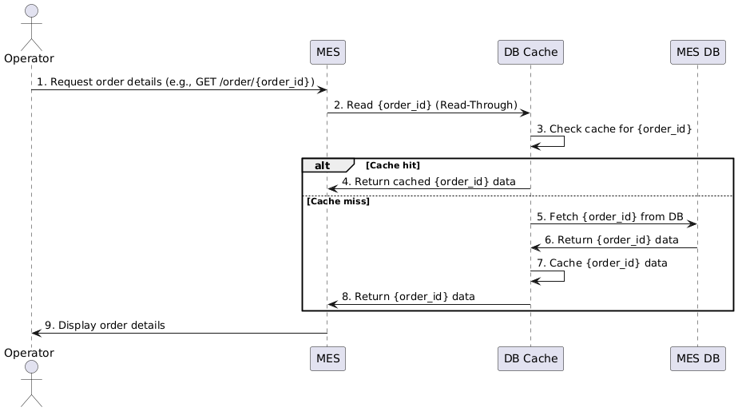

# 1. Создайте в папке Exc5 текстовый файл «Архитектурное решение по кешированию». Здесь вы будете работать над заданием.

# 2. Проанализируйте диаграмму системы и её описание. Решите, какую часть системы имеет смысл закешировать.

В разрезе проблем с MES, стоит рассмотреть внедрение кеширования вокруг сервисов MES:

 - MES
 - MES API
 - MES DB

Более прицельные прогнозы по внедрению кеширования можно сделать после анализа метрик мониторинга и логирования.
Например включить кеширование для большого числа однотипных запросов со статическим контентом.

# 3. Добавьте в файл раздел «Мотивация». Опишите здесь, почему вы предлагаете внедрить кеширование, какие проблемы оно должно решить и какие элементы системы вы планируете включить в кеширование.

## Мотивация

Без подтверждения на базе статистических данных о количестве и характере кешируемых запросов обоснование будет выглядеть не убедительно.

Однако исходя из описания задачи, проблемы которые может решить кеширование:
  
  - Жалобы со стороны операторов - MES система долго прогружается.
  - Гипотетически - жалобы пользователей API о том, что они не получили свой заказ. Не получили свой заказ потому что оператор не увидел, не смог обновить статус заказ.
  - Гипотетически - жалобы клиентов B2C о том, что заказ выполняется несколько месяцев вместо обещанных 3х недель. Аналогично, потому что оператор не увидел или не смог обновить статус заказа.

Прорабатываем решение для кеширования следующих элементов системы:
 
 - MES
 - MES API
 - MES DB

# 4. Добавьте раздел «Предлагаемое решение». Определите, какое кеширование вы будете внедрять — клиентское или серверное. Объясните, почему, на ваш взгляд, нужно использовать именно его. Если вы решите куда-то внедрить серверное кеширование, то поясните, какой паттерн будете применять — Cache-Aside, Write-Through или Refresh-Ahead. А также объясните, почему вы выбрали этот паттерн и почему остальные паттерны не подойдут или покажут себя хуже.

## Предлагаемое решение

Клиентское кеширование (HTTP-кеш):
 
 - Cache-Control: private, max-age=3600, no-cache 

Серверное кеширование Read-Through и Write-Through - все запросы read/write проходят через кеш.
Возможно использовать и другие паттерны, однако ниже перечислю преимущества такого подхода перед другими паттернами:
 
 - низкая сложность внедрения - подходит под ограниченный бюджет на мониторинг или отсутствие его
 - высокая консистентность данных - важно для работы с заказами на производстве
 - низкая вероятность ошибки - важно для работы с заказами на производстве

### операция чтения списка заказов

### запись об изменении статуса заказа

![order_update]](../Images/ORDER_UPDATE.png)

### Инвалидация

Будем использовать инвалидацию на основе изменений, считаем что это наиболее сбалансированный метод:

 - обеспечивает актуальность данных
 - достаточно прост в реализации 

Инвалидация по ключу - тоже подходит, но требует затрат на управление ключами заказов и списков заказов (фильтров).  
Временная инвалидация - не подходит потому что использованию устаревших данных оператором недопустимо при обработке заказа.
Инвалидация, основанная на запросах - не подходит, частые запросы на просмотр заказов могут создать излишнюю нагрузку.
Программная инвалидация - не подходит в виду сложности реализации.

# 5. Нарисуйте диаграмму последовательности действий (Sequence diagram). Отобразите там, как проходит операция чтения списка заказов и запись об изменении статуса заказа. Там же опишите процесс кеширования с указанием всех сущностей, которые участвуют в кешировании. Добавьте диаграмму в раздел «Предлагаемое решение».

++

# 6. В блоке «Предлагаемое решение» опишите стратегию инвалидации кеша, которую вы планируете использовать. Объясните, какую стратегию инвалидации вы предлагаете (временную, по ключу, программную или другие), почему она подойдёт и почему не подойдут другие стратегии.

++

# 7. Дополнительное задание. Если вы считаете, что может быть несколько решений и вам сложно выбрать между ними, можете описать несколько вариантов. В таком случае в разделе «Предлагаемое решение» запишите как минимум два решения и подготовьте сопоставление в виде таблицы. Например, так:
